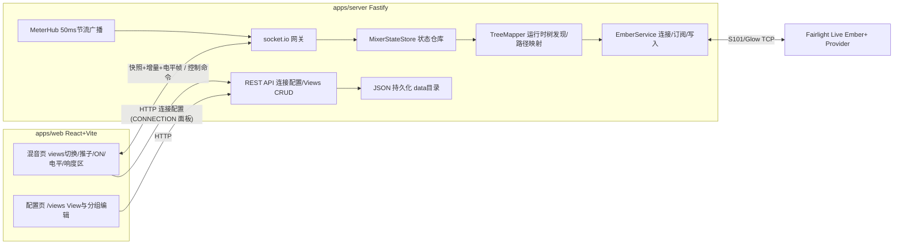

# 架构设计

## 总览



生产部署时 Fastify 同时托管前端构建产物,前后端同源、单端口。

## 后端分层职责

| 模块 | 职责 |
| --- | --- |
| `EmberService` | Ember+ 连接生命周期(连接/断线/自动重连/超时)、树展开、目录变化后重新展开、参数订阅、参数写入、function 调用。只处理原始 Ember 节点,不理解业务含义。S101 keepalive 由 `emberplus-connection` 在 TCP 连上后自动维持(每 10 s 发 KeepAliveRequest,500 ms 内无应答即关闭 socket,同时自动应答 Provider 的请求),库不提供配置项;关闭会以 `disconnected` 进入本服务的退避重连。记录最近一次连接失败的简短原因(`lastError`,如 `Timeout after 5000ms: connect`):重试期间保留,连接成功、重新配置端点或停止服务时清空;状态事件以 `(status, lastError)` 去重,原因变化时即使状态枚举不变也会广播。注意 `emberplus-connection` 会吞掉 ECONNREFUSED 并自行重拨,因此地址错误在本服务表现为 connect 超时 |
| `TreeMapper` | 运行时树发现:遍历实际树,按节点 identifier 模式识别通道、各类总线、响度节点,建立"逻辑通道模型 ↔ Ember 路径"映射。树变化时增量更新映射并发出事件;无法识别的节点安全忽略并记日志 |
| `MixerStateStore` | 规范化业务状态:通道清单(id、类型、名称、level、mute)、响度、连接状态与最近连接失败原因(`connectionError`)。事件驱动,是 WS 网关的唯一数据源 |
| `MeterHub` | 电平/响度更新的聚合与 50ms 节流,批量成帧后交给 WS 网关广播,与状态增量通道分离 |
| WS 网关 | socket.io:下行快照/增量/电平帧,上行控制命令(zod 校验 + ack 回执) |
| REST API | Ember 连接配置、views CRUD、健康检查;JSON 持久化到数据目录(默认仓库 `data/`,见「部署」) |

**关键原则:除 TreeMapper 外,任何代码不接触原始 Ember 路径。** 上层(Store、API、前端)只使用逻辑通道模型;Ember+ 是自描述协议,路径结构只能在运行时确认(见 `fairlight-ember.md`)。

## 逻辑通道模型

```ts
interface ChannelRef {
  id: string;          // stable id derived from Ember path, e.g. "channel/3", "main/1"
  kind: 'channel' | 'main' | 'sub' | 'aux' | 'mixm' | 'mtx';
  name: string;        // user-facing name from the mixer
}

interface ChannelState extends ChannelRef {
  levelDb: number;     // fader level in dB
  muted: boolean;      // protocol-level mute; UI renders inverted as "ON"
  meterDb: number;     // latest meter value in dB
}
```

ON 开关 = mute 取反,仅在前端展示层反转;协议层与后端状态始终存 `muted`。

## 前后端通信

### socket.io 事件(契约在 `packages/shared`,zod 校验)

下行:

| 事件 | 内容 | 时机 |
| --- | --- | --- |
| `mixer:snapshot` | 全量状态(通道清单+状态+响度+连接状态) | 连接建立、重连、树结构变化后 |
| `mixer:patch` | 增量(level/mute/name 变化、通道增删) | 状态变化时 |
| `meters:frame` | 紧凑数组 `[id, meterDb][]` + 响度读数 | 50ms 节流批量 |
| `system:status` | `{ ember, lastError? }`:Ember 连接状态与可选的最近连接失败原因 | 状态或原因变化时;每个 socket 连接建立后紧随快照再发一次(快照不带原因) |

上行(均带 ack 回执):

| 事件 | 内容 |
| --- | --- |
| `control:set-level` | `{ id, levelDb }` |
| `control:set-on` | `{ id, on }`(网关内翻转为 mute 写入) |
| `control:reset-loudness` | 无参数 |

电平帧使用 socket.io volatile emit(丢帧可接受,状态增量不可丢)。

### REST(`/api/v1`)

| 方法与路径 | 用途 |
| --- | --- |
| `GET /api/v1/connection` | 读取 Ember host/port、连接状态与可选的 `lastError` |
| `PUT /api/v1/connection` | 更新 Ember host/port(触发重连);响应形状同 GET,`lastError` 反映对新地址的首次尝试结果 |
| `GET /api/v1/views` / `POST /api/v1/views` | views 列表 / 新建 |
| `PUT /api/v1/views/:id` / `DELETE /api/v1/views/:id` | 更新 / 删除 |
| `GET /api/v1/health` | 健康检查 |

## View 与失配处理

Fairlight Live 不为通道提供稳定 ID:在通道之间插入或调整次序都会让 Ember identifier(以及由它派生的逻辑 `channelId`)重新编号。因此 View 以**通道类型 + 名称**引用通道:

```ts
interface ViewChannelRef {
  kind: ChannelKind;          // 类型限定,避免输入 "MIC" 与 aux "MIC" 互相误配
  name: string;               // 通道 name 参数(与节点 description 相同),trim 后精确、大小写敏感匹配
  channelId?: string;         // 勾选时的逻辑 id,只用于同名通道之间的优先裁决
  color?: ChannelPaletteKey | 'group';  // 覆盖类型默认色;'group' 只在组内有意义
}

interface ViewGroup {
  id: string;
  name: string;
  color?: ChannelPaletteKey;  // 覆盖「成员类型众数」的自动色
  channels: ViewChannelRef[]; // 组自带成员,可以为空
}

// 有序块:一行通道,或一整个组
type ViewItem =
  | ({ type: 'channel' } & ViewChannelRef)
  | ({ type: 'group' } & ViewGroup);

interface View {
  id: string;
  name: string;
  items: ViewItem[];          // 渲染顺序;归属由引用所在的位置决定
}
```

归属是**结构**而不是一个要互相对上的 id:组自带成员,所以没有成员的组同样是列表里有位置的块,可以移动、可以作落点、通道可以落在它前后。页面层仍用「扁平下标」标识一行(把根级引用与组内成员按显示顺序数下来),`view-order.ts` 内部用 `locateChannel` 换算成块路径。

匹配规则(`apps/web/src/features/mixer/view-resolver.ts`,混音页与配置页共用):第一遍认领 `kind + name + channelId` 全部相同的实时通道;第二遍为剩余引用认领第一个未被认领的同 `kind + name` 通道;每个实时通道最多被一个引用认领;名称不匹配时**不会**回退到 `channelId`(重排后 id 指向的是别的推子,比显示缺失更危险)。配置页对同名重复的实时通道标注 `DUPLICATE NAME`。

配置版本 1 的 `channels + groups` 形状由 shared 在**读取时**迁移为版本 2 的 `items`(`migrateAppConfig`):连续同组的引用合成一个组块并留在原位,没有成员的组按 `groups` 顺序追加在末尾(版本 1 就是那样显示的),`groupId` 指向不存在的组时按无组处理;更早的 `{ channelId, lastKnownName }` 引用形状也在这里一并前移。迁移只发生在读取,服务端下一次写入自然就是版本 2,业务代码不需要知道这件事。REST 写入体只接受版本 2 形状——页面与服务端一起发布。

树变化(通道删除/改名)后:

- 解析不到实时通道的引用:混音页渲染占位卡片(显示引用的 `name` + 缺失标记),不阻塞其它通道
- 配置页对失效引用给出警告,提供一键清理(改本地草稿、只删失效引用、保留分组,由 SAVE VIEW 提交;不保存即可放弃)
- View 本身不自动修改,由用户决定清理或保留(通道可能是临时移除)

### 通道分组

- 一个 View 可包含多个命名分组,分组与勾选、排序、配色一样只改本地草稿,由 `SAVE VIEW` 统一保存
- 配置页把 `items` 直接显示为「块」序列:一个组是一个组块(可改名、整块上下移动、单击 `UNGROUP` 解散,成员原位保留为无组),根级引用是单行;**没有成员的组是位置上与其它块完全平等的一个块**,有自己的把手与箭头,也仍是投放容器。分组下拉把通道移动到目标组块末尾,`UP`/`DN` 在组内移动或跨过相邻块;通道离开某个组时落在它刚才所在的块之下,也就是原来的位置
- 拖放编排(`@dnd-kit/core` + `@dnd-kit/sortable`,鼠标、触屏、键盘三种传感器,每种输入各一个,互不抢同一次按压:`MouseSensor` 在按下把手后移动超过 `MOUSE_ACTIVATION_DISTANCE_PX` 起拖,`TouchSensor` 需要手指在把手上停留 `TOUCH_ACTIVATION_DELAY_MS`、期间位移超过 `TOUCH_ACTIVATION_TOLERANCE_PX` 即视为滚动而取消,`KeyboardSensor` 由 Space 拾起):每个通道行、组头与 AVAILABLE CHANNELS 条目各有一个专用拖动把手(可访问名 `Drag <name>` / `Drag group <name>`),其它控件不响应拖动。根列表的项就是全部块(单行 `channel:<rowKey>`、组 `group:<id>`,空组同样在列),每个组内嵌一个成员列表并同时是投放容器(`groupzone:<id>`)。语义:通道行拖到根列表任意位置即重排(源在组内则脱组);拖到某组成员之间或组头/空组上即编组;组头只能在根列表移动,不能进入别的组;未勾选的可用通道可拖入任意位置或任意分组,勾选框行为不变。落点规则同列表与跨列表一致:指针在某一行(或组块)中线之上即落到它之前、之下即落到之后,命中组容器时组头(组块上半)即组首、组底(下半)即组尾;键盘无指针,同列表内下移落到目标行之后、上移落到之前,跨列表落到目标行之前(`drag-preview.ts` 的 `dropHintFor`)。把 dnd-kit 的 `over` 连同该提示解析为 `DropTarget`(`features/settings/drop-resolver.ts`),再调用 `view-order.ts` 的纯函数:`moveChannelTo(view, index, target)`(先移除源再定位,`root` 位置按**全部块**计数(含空组)、`group` 位置按组成员计数,进出组即把引用移进或移出组块的 `channels`)、`insertChannelAt(view, reference, target)`(`kind + name + channelId` 三者全等视为已存在,返回 null)、`moveGroupTo(view, groupId, position)`(未知组、越界与原位返回 null;空组与非空组同等对待);原位放下或 `over` 为空不改草稿。鼠标与触屏拖动用 `pointerWithin`(行优先于所在组容器),键盘拖动用 `closestCenter` 并以自定义坐标函数把被拖项中心对齐下一个可落目标;传感器初值集中在 `dnd-config.ts`
- 拖动呈现:跟随指针的是 `DragOverlay` 里的克隆(`DragOverlayContent`,内容全部来自 props,不受列表容器裁切与滚动影响;通道行/组头落下或取消时克隆飞向目标行,AVAILABLE 落下与移除无动画),被拖项原位留作占位。拖动期间页面维护一份**预览视图**(`drag-preview.ts`:用同一套纯函数把被拖项放到落点,草稿不变),同列表重排与跨列表(单行进组、成员出组、AVAILABLE 拖入)都按预览视图渲染,被拖项(或 AVAILABLE 的 `PlaceholderRow`)以占位行出现在将要落下的位置,目标组块保持琥珀高亮;DOM 顺序本身就是预览,两个 `SortableContext` 使用不位移任何行的 `previewSortingStrategy`,行的补间由 FLIP 列表负责。预览在 `onDragMove` 与 `onDragOver` 上都同步(指针在同一行内跨过中线也会改变落点),每次按预览视图重渲染后 `DroppableRemeasure` 全量重测 droppable 矩形(根列表重排会推移下方各组成员,dnd-kit 只重测变动列表自身的项)。松手时在预览视图内结算(`settlePreview`:落在占位所在的组容器上或自身上即提交预览视图,落在某一行上按同一中线规则结算,通常与占位一致)后一次性写入草稿,Esc 或 `over` 为空则预览消失。分组边界(首个分组之前、相邻两组之间)没有根级单行可借用,拖动通道或 AVAILABLE 条目时在这些边界渲染零高度的根级落槽(`RootSlot`,`slot:<position>`,命中带覆盖下方块顶部 `ROOT_SLOT_HEIGHT_PX`),位置按去掉被拖块后的块序列计算并画在占位行之下,命中即预览到该根级位置且悬停不动;键盘移动跳过被拖项已占的落槽。**列表末尾另有一个常驻的占位式落槽**(`root-slot--fill`,`slot:fill:<position>`,`flex: 1` 吃掉列表剩余高度,溢出时仍保留 `ROOT_SLOT_HEIGHT_PX` 可命中):只要有拖动在进行它就在,通道、AVAILABLE 条目与组头都可以落进去而成为列表最后一块——它也是组唯一能用的落槽(其它落槽标的边界是组本来就挨着的位置)。末尾是空组时,落进去就是落在该空组**之后**。它在整段拖动里始终渲染,这同时避免了「随预览出现又消失、指针落空、预览被清、逐帧反复」。**落槽没有任何视觉**:命中哪个落槽,预览的占位行就出现在哪个位置,占位行本身就是「松手会落在哪」的答案,再给落槽画一道标记只是把同一件事说两遍,而且说不一致——预览把占位行放到列表末尾之后,那一行就盖住了末尾落槽的顶部,于是同一个落点在占位行上不亮、在它下面才亮。组块是例外,指针悬停其上时仍加琥珀实线描边(`is-drop-target`):它回答的是「进组还是落在组上方」,这两种结果的占位行只差一行高度,光看占位读不出来。列表为空时的 `THIS VIEW HAS NO CHANNELS` 提示在拖动期间让位,末尾落槽因此从列表顶边一直覆盖到底边——提示占着的正是第一行的位置,留着它那里就没有落点
- 拖出移除:鼠标或触屏来源的通道行或组头离开 CHANNEL ORDER 列表可见区域超过 `REMOVE_DRAG_THRESHOLD_PX` 时,克隆变红并显示 `DROP TO REMOVE`,列表里留下的那一行(或整个组块)的占位同时由琥珀虚线转为红色,指针回到列表内即恢复;松手即把该引用(组头则连同全部成员)从草稿移除,与取消勾选等价;键盘拖动不触发。占位停在离开列表前最后一个落点而不回弹原位:指针在容器边缘进出会很频繁,每进出一次都抽动一下列表比停住更难用
- 行级删除:每个通道行与每个组头的最右侧有一个删除按钮(自绘 ×,可访问名 `Remove <name>` / `Delete group <name>`),点击即把该引用(组头则连同全部成员)从草稿移除,语义与拖出移除完全一致,调用的也是同两个纯函数(`removeChannel` / `removeGroupWithMembers`)。**不做二次确认**:删除只改草稿,`SAVE VIEW` 之前都能用 `DISCARD CHANGES` 整体撤销。它补上了另外两条路径的缺口——失配引用在 AVAILABLE CHANNELS 里没有条目,取消勾选无从谈起;拖出移除只对鼠标与触屏生效,键盘此前没有任何删除手段。组头上它与 `UNGROUP` 并列而语义相反:`UNGROUP` 只解散组、成员原位留为无组行,删除按钮连成员一起带走。两者在拖动期间都禁用,因为列表这时渲染的是预览视图、行拿到的是预览索引,按它删会删错行。删组不清理折叠集合(组 id 来自 `createLocalId` 不会复用,孤儿 id 撞不上新组),与 `UNGROUP` 的既有行为一致
- 拖动中的滚动:关闭 dnd-kit 自带的自动滚动(它只滚动被拖节点的祖先,从 AVAILABLE 拖出时会滚错容器),由 `ListAutoScroller` 按拖动期间自行跟踪的指针位置(dnd-kit 的位移量含滚动补偿,不能直接用)在 CHANNEL ORDER 列表**可见部分**的上下边缘区(`AUTO_SCROLL_EDGE_PX`)内按距离比例逐帧滚动该列表(上限 `AUTO_SCROLL_MAX_STEP_PX`),每次滚动后节流调用 `measureDroppableContainers` 重测各行矩形;拖动期间 AVAILABLE 列表加 `is-drag-locked` 禁止竖向滚动,两个列表容器 `overflow-x: hidden`
- 混音页按同样的连续段渲染,再由分页切成页(见「前端结构」的「混音页分页」):每个组段复用 `All Channels` 的类型分区样式(标题栏的标题 = 组名,计数 = 在场通道数,跨页时标题栏在新页重复并标 `CONT`),无组引用平铺为不带标题栏的段;含分组的 View 的 `TYPE PAGES` 开关让每个组从新的一页开始
- 分组折叠:组头把手之后有一个折叠按钮(自绘 chevron,`aria-expanded`、`aria-controls` 指向成员列表,可访问名 `Collapse group <name>` / `Expand group <name>`),空分组不显示。折叠是**编辑器的 UI 状态**,不进 View 模型、不持久化,切换 view、`UNGROUP` 与 `DISCARD` 都会清掉;折叠时成员整体不渲染(而不是隐藏,隐藏的行仍会注册零矩形的 droppable),组头保留全部控件,`<nn> CH` 就是成员数提示,组块加 `is-collapsed`。折叠的组仍是投放容器:`groupzone` 的 `data` 带 `collapsed`,`keyboardStops` 把「空的或折叠的」组当作停靠点(展开的组与成员共用矩形,只有成员算停靠点);占位行一旦预览进某个折叠组,该组立即展开并退出折叠集合,拖动结束后保持展开。展开与预览在同一批提交,占位行不会被渲染进还关着的组;`GROUP` 下拉把通道放进某个组时同样先展开——两条通往组内的路径都保证「放进去的东西看得见」,也顺带避免了「折叠时被清空的组,再放回第一个通道又被藏起来」(空组不显示折叠按钮,没有控件能把它重新打开)
- 键盘拖放的收敛:一次方向键只产生一次移动。每次预览后行会重排,dnd-kit 会带着上一次方向键定下的落点重新做碰撞检测,那些额外的碰撞只是几何在安顿,不是新的意图,所以 `syncPreview` 按「键盘步数」忽略它们;松手时同理,只有当最后报告的 droppable 与预览所在的列表相同(只能微调位置)才用它结算,否则直接提交预览——否则折叠组一展开,盖在组头上的根级落槽就会立刻把行拽回根列表
- 分组与通道条的颜色(解析集中在 `features/mixer/channel-colors.ts`,配置页与混音页共用):
  - `groupAccent(group)`:组有 `color` 就取该色,否则取**成员类型的众数色**——按引用记录的 `kind` 统计(解析不到实时通道的成员同样计入,树加载中颜色因此不会抖动),平局取成员里最先出现的那个类型,没有成员时按输入通道色。刻意忽略成员自己的覆盖色,否则跟随组色的成员会与组互相引用
  - `channelAccent(kind, color, group)`:`color` 为 `'group'` 时跟随 `groupAccent`,自定义色直接取,没有颜色则取类型色;`'group'` 却没有组(草稿编辑中的一瞬)按类型色兜底
  - 通道行的调色板为 `AUTO` /(仅在组内)`GRP` / 6 个色块,组头另有 `GROUP COLOR`(`AUTO` + 6 色)。「跟随组色」画的是缩写字样而不是色块——它显示的颜色往往与右边某个色块完全一样,两个同色方块分不出哪个是「跟随」哪个是「选定」;颜色本身由行左侧的 accent 条呈现。两处调色板共用 `PaletteControl.tsx`,由调用方传入 `choices`(各自的可访问名、色块或字样)。进出组时颜色自动转换(`view-order.ts` 的 `colorForMembership`,由 `assignGroup`、`moveChannelTo`、`insertChannelAt`、`removeGroup` 共同调用):进入某个组时 `AUTO` → `'group'`,离开组时 `'group'` → `AUTO`,自定义色两个方向都保持,组内重排不变。因此已保存的旧 view 里组内没有颜色的引用会在**跨组或出组移动一次后**升级为 `'group'`,不做批量迁移
- 服务端只校验组 id 唯一、根级引用的 `color` 不得为 `'group'`;归属是结构,没有可悬空的引用要校验

## 持久化

配置文件默认是仓库根的 `data/config.json`,可由 `FLWC_DATA_DIR` 改到别处(容器里是 `/app/data`);zod 校验,
写入原子化(临时文件 + rename):

```jsonc
{
  "version": 2,
  "ember": { "host": "127.0.0.1", "port": 9000 },
  "views": [
    {
      "id": "uuid",
      "name": "FOH",
      "items": [
        {
          "type": "group",
          "id": "g1",
          "name": "Rhythm",
          "color": "teal",
          "channels": [
            { "kind": "channel", "name": "BASS", "channelId": "channel/3", "color": "group" },
            { "kind": "channel", "name": "GTR", "channelId": "channel/4", "color": "purple" }
          ]
        },
        { "type": "channel", "kind": "main", "name": "Main", "channelId": "main/1" },
        { "type": "group", "id": "g2", "name": "Spare", "channels": [] }
      ]
    }
  ]
}
```

版本 1 的文件在**读取时**迁移为版本 2(见「View 与失配处理」),下一次写入即以版本 2 落盘;其它版本号一律当作无法识别。文件损坏或缺失时回退默认配置并告警,不崩溃。

文件**缺失**是唯一的例外:此时若有环境变量种子值(见「部署」),`ConfigStore.load()` 会把「默认配置 + 种子
ember」原子写到磁盘再返回,并记一条 info 日志;写不进去(如目录只读)只告警,仍返回带种子的内存配置,下一次
`update()` 再试。种子写入与其它写入排在同一条 `writeTail` 上,以免启动期间到达的 PUT 与它交错。

## 前端结构

- 路由:`/` 混音页(CONTROL DESK)、`/views` 配置页(VIEW CONFIGURATION),基于 history API 的自绘路由(`lib/router.ts`,不引入路由库),浏览器前进/后退可用;两页互斥挂载,切换时滚动回顶部。生产环境 Fastify 对非 `/api` 的 GET 未命中返回 `index.html`,刷新与深链接可用。路由模块缓存「当前已放行的路由」并从该缓存出快照(无订阅者时重读 URL),`setNavigationGuard(guard | null)` 挂一个守卫:`navigate()` 改写 history 前先询问,被拒绝则不改 history、不通知;`popstate` 目标与缓存不同时也询问,被拒绝则沿来路撤销该次跳转(每个 history 条目的 `state.routeIndex` 记录序号,`history.go(当前序号 - 目标序号)` 对后退、前进与多步跳转同样成立;没有序号的条目只能来自后退,用 `history.forward()`),缓存不变,因此 `useRoute()` 不会闪到被拒绝的页面。只有配置页注册守卫(挂载时注册、卸载时置 null),混音页不注册
- 配置页是 CONTROL DESK 的次级页面:页头为带箭头图标的返回按钮 + 面包屑 eyebrow;页面固定为视口高度,视图列表与编辑器两列各自滚动,不产生整页滚动条。`features/settings/` 拆为 `SettingsPage`(状态、草稿与保存)、`ViewDndContext`(dnd-kit 上下文与落下解析)、`ChannelOrderList` / `SortableChannelRow` / `SortableGroupBlock`(右侧列表,`ChannelOrderList` 同时持有 FLIP 列表并经 `flipRef` 把 `capture()` / `skipNext()` 交回页面)、`PaletteControl`(两处共用的调色控件)、`DeleteButton` 与 `RowMenu`(行与组头共用的删除键和窄屏菜单)、`AvailableChannelList`(左侧清单)与 `DiscardChangesDialog`
- 列表位移动效:`features/settings/use-flip-list.ts` 挂在 `ChannelOrderList` 内部(它才是渲染拖动预览的组件),在**每次提交**后的 `useLayoutEffect` 里读取列表内所有 `[data-flip-key]` 元素的 rect 并刷新基线,只有当依赖(渲染所用的视图)变化时才补间:位移超过 `FLIP_MIN_SHIFT_PX` 的元素先设反向 `transform`,下一帧清除并以 `transform <FLIP_DURATION_MS>ms ease-out` 过渡,结束后移除内联样式(`FLIP_CLEANUP_FALLBACK_MS` 为该时长的三倍作兜底)。每次提交都测量、只按依赖补间,是因为行也会因与重排无关的原因移动(重名标记出现、清单解析完成),那些不该被当成重排。组成员只补间相对所属组块的位移,新出现的元素与标了 `data-flip-skip` 的元素(被拖行与 AVAILABLE 占位行,它们要跟着指针而不是拖在后面)不处理。行的 key 为 `kind:name:channelId#<出现序号>`(`row-keys.ts`,按显示顺序数,根级行与组内成员一起),组块为 `group:<id>`,React key 与 dnd-kit id 同用该值。箭头移动、编组/脱组、`UNGROUP`、整组移动、勾选加入/移除、`CLEAR INVALID`、**拖动期间占位行每一次移动**、Esc 取消回位与拖放落下都走同一套补间;拖放落下前先把拖动态的 rect 记为基线(`capture()`),并关闭 dnd-kit 自身的布局动画,避免两套补间叠加;切换 view 时先 `skipNext()`,两个 view 里 key 相同的行才不会「飞」过去。`DragOverlay` 落下动画的时长是 `DROP_ANIMATION_MS`(`dnd-config.ts`)。测量读的是**自然位置**(`flip-geometry.ts` 的 `naturalRect`:`getBoundingClientRect` 减去元素自身及其 `[data-flip-key]` 祖先当前生效的 translate),因为 `getBoundingClientRect` 把补间中途的 transform 也算进去了。由此得到两条性质:自然位置没变的行**完全不被碰**,正在跑的补间原样继续;补间途中又被推动的行从**当前视觉位置**起步(保留它已有的 translate),不先跳回再滑。dnd-kit 的 droppable 也用同一套几何(`dnd-config.ts` 的 `VIEW_MEASURING`),碰撞检测因此始终针对预览的最终布局——dnd-kit 自带的 transform 无关测量只反解节点自身的 transform,组成员还被所属组块带着走,不够用。`prefers-reduced-motion: reduce` 时不做补间
- 配置页的响应式:VIEWS 一列宽 `clamp(12rem, 20vw, 21rem)`,随视口连续收窄(笔记本上仍是 21rem,1366px 约 273px,1024px 约 205px),不用断点;视口 ≤1200px 时它已到最窄一带,再压缩内边距与条目行高。CHANNEL ORDER 一列是 `container-type: inline-size` 的查询容器,**每一行都必须保持单行**——换行的行不再读作「一个通道和它的控件」。三档按代价从小到大让出宽度:容器 ≤45rem 去掉通道名列的 7rem 下限(名字本来就带省略号)并收紧行内间距;≤36rem 隐藏 6 个色块、改用 `PaletteControl` 一直并排渲染着的 `<select>` 菜单,并隐藏 `GROUP` 下拉前面的字样(`<select>` 自带可访问名);≤26rem(手机竖屏)把**上下按钮、`GROUP` 下拉、颜色菜单、`UNGROUP`、删除按钮**一起藏掉,改用行尾一直渲染着的汉堡菜单(`RowMenu`),行只剩把手、序号、accent 与名字。控件始终都在 DOM 里,由容器查询 `display: none` 只显示一套,被隐藏的那套不进无障碍树,也不参与栅格——因此切换不需要测量、不引入状态,拖动中也不会重排。`RowMenu` 是一个盖在汉堡方块上的透明原生 `<select>`:弹出层由浏览器绘制,不需要定位、不会被列表裁切、不改行高,手机上直接用系统选择器;它的项是 `<option>`(`role="option"`),因此不与宽档已经占用的可访问名(`Move <name> up`、`<name> group`、`Ungroup <name>`)重名——jsdom 不求值容器查询、两套控件在测试里同时在场,这一点是必须的。它没有「当前值」,选中即执行并复位;当前所在组与当前颜色在选项文本前加 `•` 标出。汉堡档下这个菜单是行上唯一的控件,又只出现在没有指针的设备上,所以放大到 2.75rem 的方块,行高随之从 54px 长到 62–63px。前两个阈值是实测的(以**组内成员**为准,它额外带着组缩进,是最窄的一种行):带名字下限的形态撑到 43.5rem、带截断名字的撑到 34.6rem,阈值取在其上,保证换挡时上一形态仍然放得下;第三个阈值不是为了放得下(菜单形态一路撑到 21.3rem),而是为了覆盖手机竖屏——26rem 对应约 440px 以内的视口
- 未保存改动保护:`features/settings/view-dirty.ts` 的 `isViewDirty(saved, draft)` 结构比较名称与 `items`(块的顺序、每块是什么、每个引用的全部字段,缺键与 `undefined` 相等);空组换了位置同样算脏,虽然没有任何通道动过;脏态三处提示为 `SAVE VIEW` 的 `is-dirty` 高亮、旁边的 `UNSAVED` 徽标、左侧列表当前项的圆点(`data-dirty="true"` + 视觉隐藏文本 `Unsaved changes`)。返回混音页(页头按钮与浏览器后退)、切换到另一个 view、删除当前 view(两段式的第二次点击)、`ADD` 新建 view 四条路径在脏态时统一进入一个 `pendingAction`,弹出自绘 `UNSAVED CHANGES` 对话框(`role="dialog"`、`aria-modal`、正文按路径区分),`DISCARD` 先清空草稿再执行待定操作,`KEEP EDITING`(以及 Esc、背景点击)关闭对话框并保留草稿;点击已选中的 view 不再重置草稿。脏态时在 `window` 上注册 `beforeunload`(`preventDefault` + `returnValue`)拦截刷新与关闭标签页;保存成功或 `DISCARD` 后提示立即消失,保存失败保持脏态。CONNECTION 面板不做脏检测
- `store/`:zustand——`mixerStore`(快照+增量合成、socket/Ember 连接态与 `emberLastError`)、`meterStore`(高频帧,独立于 React 树渲染,电平表组件直接订阅避免整页重渲)、`viewStore`
- `lib/`:`socket.ts`(Socket.IO 绑定与控制 ack)、`views-api.ts` 与 `connection-api.ts`(REST client,共用 `api-request.ts` 的 fetch 注入、zod 响应解析与 `{ error: { code, message } }` 读取)、`router.ts`
- 连接配置:两个页面头部的连接状态灯是按钮(可访问名 `Connection settings`),点击打开 `features/connection/` 的 CONNECTION 面板——自绘模态对话框(`role="dialog"`、`aria-modal`、焦点进入面板并在其中循环、Esc/背景/CANCEL 关闭、关闭后焦点回到状态灯;模态行为由 `components/use-modal-dialog.ts` 提供,配置页的确认对话框复用同一 hook 与样式 token),在 `App` 层渲染一次并跨路由存活。面板打开时从 `GET /api/v1/connection` 回填 host/port,提交前用 shared 的 `emberEndpointSchema` 校验并就地显示英文错误,服务端 400 的 message 同样就地显示;Ember 已连接时 APPLY 先变为 `CONFIRM RECONNECT` 并说明将断开当前设备,再次点击才发 PUT;提交成功后面板保持打开,实时显示 `mixerStore` 中的 Ember 状态与 `lastError`。面板只写应用配置,不接触任何通道参数
- 混音页空态按原因分流(`features/mixer/empty-state.ts`,配置页 AVAILABLE CHANNELS 列表复用):socket 离线 → `BACKEND OFFLINE`(无 CTA);socket 已连但 Ember 未连接 → `MIXER NOT CONNECTED` + 当前状态 + `lastError` + `CONFIGURE CONNECTION` 按钮直达面板;已连接且快照通道数为 0 → `NO CHANNELS ON THE MIXER`(无 CTA);已加载过清单后短暂 `reconnecting` 继续显示既有条带并禁用控件,不回退到空态;空 View 仍显示 `THIS VIEW HAS NO CHANNELS`(配置页的同一文案改为列表内的一行,列表容器始终渲染,拖动期间该行让位给末尾落槽)
- 推子拖动:拖动中本地值优先(pending 态),ack 后释放;远端更新在拖动中不覆盖本地值。一次拖动属于一个 `pointerId`,落在同一个帽子上的第二根手指既不改它也不结束它(见「多指」)。滚轮路径的 commit 时机不同——它不按步 commit,整次手势只在滚轮静默后由归属模块回调 commit 一次(见「滚轮」)
- 混音页分页:混音区不横向换行也不整页滚动,而是显式切页。`features/mixer/page-layout.ts` 用像素常量描述几何(条宽、标题栏高、条间距、段间距、页最小高度、安全区宽、翻页时长),`MixerPage` 把它们作为 CSS 自定义属性写在 `.mixer-shell` 上,`styles.css` 一律 `var(...)` 读回——TS 与 CSS 只有一个真相来源。`pagination.ts` 的 `paginate()` 是纯函数:按「页非空则先加段间距或条间距,再加条宽」的代价贪心逐条填充,超出剩余宽度就开新页;**段的标题不占宽度**——标题栏画在条带之上而不是之旁,所以代价函数里没有它;带标题的段跨页时新页重复标题栏并标 `continued`,空段不产生输出,容器比一条还窄时每页仍恰好一条。`TYPE PAGES` 开关(偏好键仍是 `flwc.layout.typeRows`)让每个带标题的段从新的一页开始,不带标题的段照常续排。切页只用「自然」几何(最窄的那套),`page-fit.ts` 的 `fitPages()` 再把每页填不满的余量花掉——纯函数,只会让数字变大,因此永远不会反过来改动页的切法:余量先开间隙(条间距与段间距各有上限),间隙吃不下的部分才拉宽通道条,条宽取各页允许量的**最小值**作为全局唯一值,于是翻页不会让某一条在手下改变宽度、也不会有页溢出;还有剩就居中。条宽的上限目前设成与下限同值,拉伸这一步因此恒为 0——通道条在所有视口都是同一个宽度,余量全部进间隙与居中;把上限调高即重新打开拉伸(`--page-lead` 作为首条之前的空白)。还塞得下一条通道的页是「条数用完」而不是「宽度用完」(末页,或 `TYPE PAGES` 下的短页),它不自己居中,而是左对齐地沿用前一页的间隙与 `--page-lead`,这样页内条数变化时通道位置不漂移。段的标题是一条**横跨该段所有条带**的标题栏(`.mixer-section` 是「`--section-header-height` 高的标题行 + `minmax(--strip-min-height, 1fr)` 的条带行」两行 grid,条带装在 `.mixer-section__strips` 里),栏与它那排条带同宽同左缘,跨页的那半段在栏里标 `CONT`——计数是整段的数,不是本页这几条的数。**没有标题的段也占住标题行**,否则同页并排的两段条带起点会差一个栏高。混音台缺的是宽度不是高度(条带无论如何都是一个视口高),所以标题从宽度挪到高度是划算的一边:一页能多装条带,代价只是条带矮一个栏高。外壳是 `height: 100dvh` 的三行 grid,中间的 `.mixer-deck` 左格是分页视口 `.mixer-bays`、右格是安全区;通道条 `height: 100%`,推子与电平表的轨道行为 `minmax(0, 1fr)`,因此条带随视口长高、推子轨道随之拉长。视口高度不足时的降级仍然由 CSS 得到,但滚动主体是**页而不是视口**:翻页轨道已经占用了视口的纵轴,所以 `.mixer-bays` 只裁剪,页恒为一个视口高(轨道因此总是整数个视口、`translateY` 不会错位),`--strip-min-height` 是 `.mixer-section` 条带行的下限,超出时由页自己滚动。这个下限逐像素决定「混音台不滚动所需的最矮窗口」(下限 + 标题栏 + 页的上下内边距 + 外壳的页头页脚),调它 1px 那个窗口高度就变 1px——滚动条是隐藏的,所以窗口不够高时底部那行读数会无声地落到折叠线以下,这个数因此是按目标设备的窗口高度定的,而不是按观感。这根滚动条是隐藏的:它若占宽,会从页的内容盒里扣掉而分页量的是视口,满页最后一条又会被裁掉。`use-pager-viewport.ts` 用 `ResizeObserver` 量视口宽度(经 callback ref 挂载,因为空态会把整个 deck 换掉;附着时同步读一次,没有 `ResizeObserver` 时就以这次为准),`use-pager.ts` 持有 `pageIndex` 并始终钳在现有页内——页数减少时钳到末页并**留在那里**,页数恢复也不弹回,只有切换 view 才回到第一页。`StripPages.tsx` 把页竖排成 `flex: 0 0 100%` 的轨道,整体 `transform: translateY(calc(-100% * var(--page-index)))` 过渡翻页(`prefers-reduced-motion: reduce` 下不过渡),方向与安全区的上/下翻页键一致;**只挂载当前页与前后各一页**,其余渲染为占位的空页,以此约束在线 `Meter` 订阅数;跨页重复的标题 `id` 带页号后缀,因为相邻页会同时挂载;当前页带 `data-current`,滚轮要问它还剩多少可滚。翻页入口有四类:安全区 `PageRail.tsx`(`aside[aria-label="Pages"]`,上/下翻页键与 `output[aria-label="Page"]` 页码,首末页对应键置灰;页码本身是跳转控件——读数态是 `button[aria-label="Jump to page"]`,按下换成同名的数字输入框并全选,回车或失焦提交、Esc 取消,越界由 `usePager.goTo` 的钳位兜住,单页时置灰;触摸屏没有 hover,所以它常驻一圈输入框的边框作为「可点」的唯一提示。失焦也提交是因为触摸屏的数字键盘没有回车键。下半是滑动手势的空轨道 `[data-swipe-surface]`)、键盘 `PageUp` / `PageDown`(`window` 监听,`defaultPrevented` 或事件目标命中 `[role="slider"], input, select, textarea, [contenteditable]` 时不处理,聚焦的推子因此保留 ±10 dB 粗步)、以及滚轮。安全区里不放任何会影响声音的控件,这是它作为「可以随便碰的表面」的前提,由集成用例把关(6.4 之后它还放了一个全屏键,那是浏览器边框的开关,不碰声音)
- 滚轮:滚轮是推子的第五条输入路径,也是翻页入口,两者在同一页面上靠归属模块分开。`lib/wheel-delta.ts` 把三种 `deltaMode` 归一化为像素(推子路径用它),并决定哪一轴算翻页行程:**只算竖轴**,唯一的例外是 Shift 按下时——浏览器此时把竖向滚动换到 `deltaX`,那是从推子轨道上翻页的逃生口。非 Shift 时横轴一律不看:触控板做竖向滑动时,竖向位移还不够一整像素的那些帧仍会把手在板上的横向漂移报在 `deltaX` 上,把它当竖向行程会按漂移的符号翻页,表现为「往下滑却往下翻了页」。`lib/fader-wheel.ts` 累计位移、每 `FADER_WHEEL_STEP_PX` 出一步(余数保留,一次事件可出多步,方向反转清零累计),调用方按步走 `stepLevelDb`(1 dB,Alt 为 10 dB,与键盘完全对齐)。`lib/page-wheel.ts` 累计到阈值即翻一页并进入冷却,冷却中吞掉后续事件**且不攒行程**,冷却结束就从零重新计数——重新武装只看冷却,不再要求滚轮静默,否则一直滑动的手指永远等不到静默、第一页之后就再也翻不动。防止一次惯性飞过好几页的是**惯性判定**:reducer 多收一个 `momentum` 入参,这次手势已经翻过页之后,标为惯性的行程一律吞掉且不入账——甩一次就是一页,尾巴再长也不再翻;还没翻过页时不拦,那是操作员的甩劲刚到。惯性是形状不是大小(逐帧衰减、且两轴按同一比率衰减),看一个事件判不出来,要看一串,所以分页路径的滚轮经 `wheel-gestures`(MIT,无运行时依赖)读入,由它给出 `isMomentum` 并顺带归一化单位与轴向;手指重新按上板,它会取消惯性态,翻页权立刻交还。阈值那一层保留作为「手指还在推」时的节奏:同一手势内(中途没有静默过)续翻要 `PAGE_WHEEL_REPEAT_THRESHOLD_PX`,是首翻阈值的两倍,静默 `PAGE_WHEEL_QUIET_MS` 后回到首翻阈值。冷却时长略小于翻页动画时长,下一页因此在上一页落定前起步,连翻不顿挫——两个常量分居 `lib/` 与 `features/mixer/`,由集成用例断言这条关系。`lib/wheel-gesture.ts` 记录当前手势的持有者(`page` 或某个推子的 channel id)与最近事件时间,时钟注入、模块单例:一次手势从首个事件起、到静默 `WHEEL_GESTURE_IDLE_MS` 止,期间持有者不换人,非持有者收到事件只续期并吞掉,静默后回调持有者一次。推子的回调就是 commit,所以滚轮调节整次只写一次;`page` 的回调是空操作。两处监听都是非 passive 的原生 `wheel` 监听(React 的 `onWheel` 是 passive,不能 `preventDefault`):推子用 ref + `addEventListener` 挂在自己的 `div.fader__track[data-wheel="level"]` 上,分页由 `WheelGestures.observe('.mixer-deck')` 代挂(库自己就是 `{ passive: false }`,回调在事件派发中同步执行,所以回调里 `preventDefault` 仍然有效),并配 `preventWheelAction: false` + `reverseSign: false`——拦不拦由归属与让位规则决定,符号保持原生。分页回调先用 `target.closest('[data-wheel="level"]')` 判断表面,手势收尾那次由定时器发出的回调(`isEnding`)没有新的真实事件,直接跳过。由此得到几条性质——推子轨道上的非 Shift 滚轮永远不翻页(推子被锁定、断线或正在拖动时是被忽略,而不是转为翻页);Shift 只在手势的起始事件上判定,中途按下或松开都不转移归属;手势中推子被锁定或断线时立即 commit 当前值,之后的事件既不调推子也不翻页;翻页把新页的推子轨道滑到指针下方时,惯性尾巴因持有者仍是 `page` 而不会动那个推子。唯一让位的情形是视口过矮的降级态,且是**滚到底再接着翻页**:当前页(`.mixer-page[data-current]`)还有可滚余量时,非轨道、非 Shift 的滚轮不 `preventDefault`,交给浏览器纵向滚动,并把翻页累计清零——滚动不算翻页行程,回到边界必须重新攒满一个阈值,免得在边界上抖动;滚到那个方向的尽头后,滚轮才照常翻页。安全区不在这条让位规则之内:它下面没有任何可滚的东西,让位只会让它彻底失灵,所以落在 `.page-rail` 上的滚轮永远直接翻页
- 触摸翻页:手指拖动与滚轮共用**同一个**行程累加器(`pageWheelRef` 与 `reducePageWheel`),因此只有一套翻页节奏——首翻、同手势续翻、静默判定与冷却全部照搬滚轮那套常量,没有第二组阈值。监听同样挂在 `.mixer-deck` 上:`touchstart` / `touchmove` 用 passive,`touchend` / `touchcancel` 不用(要 `preventDefault`)。`touchstart` 只受理单指、且起点不在 `[data-wheel="level"]` 内的触摸——推子用 pointer 事件自己拖,决不能同时翻页——并把累计清零(冷却仍然算数);`touchmove` 的位移取「上一帧 Y − 本帧 Y」,手指上滑等价于滚轮下滚,中途多出一根手指即停;通道条区仍然是「滚到底再翻页」(浏览器在滚时清零累计),安全区照旧直接翻页。`touchend` 若这次拖动翻过页就 `preventDefault`,免得同一个手势顺手按下它松手时压住的东西——安全区的翻页键和通道条上的 ON 都在一指宽之内
- 触屏防误触:浏览器自己的触摸手势在混音台上全是隐患,所以在 `html, body` 上一次关掉——`overscroll-behavior: none`(下拉刷新与滚动链)、`touch-action: manipulation`(双击缩放,平移与捏合保留,因为视口过矮时页要自己滚)、`user-select`/`-webkit-touch-callout`(长按菜单与误选中);捏合缩放**有意不禁**,`user-scalable=no` 没有加。选中在两类元素上还回去:输入框、textarea 与 `contenteditable`,以及错误文案(`.connection-dialog__error`、`.connection-dialog__field-error`、`.empty-console__error`、`.panel-empty__error`、`.missing-warning`)——报障的人得能把提示复制走。`-webkit-tap-highlight-color: transparent` 从 `button` 扩到 `[role='slider']`、`label`、`select`、`input`、`a`。高度一律 `dvh`:移动浏览器收起地址栏时 `vh` 不会跟着变。全部 `:hover` 规则都在 `@media (hover: hover)` 之内,否则触屏上最后被碰过的控件会一直亮着直到碰到别的;与状态合写的七组选择器(`.is-selected`、`.is-checked`、`.fader.is-dragging`、`[aria-pressed='true']`、`:focus-within`)拆成两条,状态那一半留在查询外,声明相同因此视觉不变。这些规则 jsdom 一条都看不见(它既不解析样式表也不算样式),所以回归锁是 `src/styles.test.ts`——按字符走一遍源文件,跳过注释、字符串与圆括号内的一切(`content: '{'` 不能开块,`:has(select:enabled)` 里的括号不能算深度),断言每一处 `:hover` 都落在某个 `(hover: hover)` 块内、没有 `vh` 残留、四条全局规则与两类 `user-select: text` 在场;扫描器本身另有一组内联夹具的自测。`data-swipe="none"` 是「手指翻页永远不从这里起手」的约定属性,目前只标在 ON 按钮上——推子轨道由 `[data-wheel="level"]` 排除,两者一起写在 `handleTouchStart` 的 `closest()` 里;电平表、名称头、读数、分区标题栏、间隙与安全区照旧可以起手
- 多指:推子按 pointerId 认手指。`Fader` 记住拿到帽子的那个 `pointerId`,不是它的 `pointerdown` 在双击判定**之前**就被挡掉(既不重置起点,也不会因落在 500 ms 窗口内被当成双击回 0 dB),不是它的 `pointermove` 与 `pointerup` 一律忽略——第二根手指既不劫持也不结束第一根手指的拖动。指针 id 在 `finishPointer` 里于 `dragging` 判断**之前**清掉:按下与松开落在同一个 React 批次里时 `dragging` 还是假,清在后面会把帽子永远留给一根已经离开的手指,那个推子此后再也按不动。多个推子本来就各自持有状态与 pointer capture,可以同时拖;全局拖动光标类 `fader-cap-dragging` 因此改成模块级计数,从 0 变 1 时加、从 1 变 0 时摘,加减挂在既有的 `useEffect([dragging])` 的 body 与 cleanup 上,由 React 保证配对(放进事件处理函数会在 StrictMode 双挂载与上面那条早退路径上漏掉减一,类就再也摘不掉)。命中区尺寸维持现状,实测无需放大
- 常亮与全屏:`features/mixer/use-wake-lock.ts` 只在混音页挂载,两条路径。原生路径用 Screen Wake Lock API:可见且尚未持有时 `request('screen')`,sentinel 收到 `release`(系统收回、切后台)回 `idle`,`visibilitychange` 回到可见时重申请——被拒过也照样再试,平板从锁屏回来常常就给了。降级路径是一个静音的循环视频(`lib/wake-media.ts`,两个 data-URI 摘自 nosleep.js 0.12.0,MIT,不是依赖),**铺满视口且完全透明**——几何是这条路的全部诀窍。Chrome for Android 给静音视频发屏幕锁有一个**可见面积门槛**,目标平板上实测:1×1 px 拿不到锁,看得见的 160px 方块同样拿不到,铺满视口才拿得到;而它不看 `opacity`(可见性按几何判定,与 IntersectionObserver 同一套),所以满屏 + `opacity: 0` 两全。因此 `display: none`、`visibility: hidden` 与「几个像素的小方块」这三种写法都会让屏幕在演出中途熄掉;`.wake-media` 另加 `pointer-events: none`,免得这张盖住整台桌子的透明布吞掉每一次触摸。**这个门槛是 Chrome 的、没有文档、随版本可变**,可靠的路仍是安全上下文加原生 API。另一条同样实测有效的路是「不静音地播放」(带音频轨的媒体在任何尺寸都能拿到锁,且音量必须大于 0),但那要求浏览器持续输出音频流、会去抢 Android 的 audio focus,**在演出现场的控制平板上不采纳**。两个素材**都带音频轨**(立体声 48 kHz、1.057 秒,解码后每个采样都是 0,峰值 −∞ dBFS);nosleep.js 依赖的正是这条「听得见但是空的」轨道,而本项目靠的是 `muted`,素材本身的静音只当第二道防线。视频挂在 `body` 上而不是混音页外壳内:外壳是 React 管着每个子节点的 grid,而一张 `position: fixed` 的透明布不需要它任何东西;离开混音页由 hook 的 cleanup `destroy()` 移除。静音的媒体不受自动播放策略约束,所以视频**自己开始播**,不等任何手势——平板是接在跑服务的那台机器上充电的,机器开机时平板自己亮屏,身边并没有人去碰它;`document` 上的 `pointerdown` / `keydown` 仍然挂着,作为某些引擎拒绝自动播放时的兜底。页面隐藏即 `pause()`,回到可见再自动试一次;在途的那次播放若被暂停或拆除追上,落地时不会宣告 `active`(以控制器的 `playing` 为准)。**常亮跟随 Fairlight Live 的在线状态**(`socketConnected && emberStatus === 'connected'`):跑服务的机器一关,socket 先断,常亮随即放手、视频元素移除,平板按自己的熄屏计时睡过去;机器回来后 socket 自动重连、Ember 接上,这一路又自己接管,全程不需要任何人碰平板。极短的循环在部分设备上 `loop` 不可靠,`timeupdate` 里过 0.5 秒手动回 0。两条路径都静默降级:失败只在 console 留一行,屏幕上什么都不显示,状态写在 `.mixer-shell` 的 `data-wake-lock` 上(`unsupported` / `idle` / `active` / `denied`)只供测试与冒烟读取。**Wake Lock API 只在安全上下文暴露**,平板走 `http://<局域网 IP>` 时 `navigator.wakeLock` 是 `undefined`,走的因此永远是视频那条路——本项目是本地部署,不打算引入 HTTPS。全屏是 `lib/use-fullscreen.ts` 与**安全区最底部**的一个键(`PageRail` 内,`page-rail__step` 同一套尺寸与质感,四角括号图标,进入/退出两种图形),`fullscreenEnabled` 与 `requestFullscreen` 都在才渲染——不做 `webkit` 前缀回退,所以 iPhone Safari 上这个键根本不出现,而不是出现了按不动。它放进安全区是因为那是拇指够得着的地方,而页头那行是给鼠标看的小字;这不违背安全区的底线——**那条底线是「不得有影响声音的控件」,全屏只动浏览器自己的边框**。状态由 `aria-label`(`Enter full screen` / `Exit full screen`)表达而不是 `aria-pressed`:安全区里带按下态的按钮只可能是通道控件,而这里一个都不该有,集成用例连同新键一起把关。它坐在滑动轨道之后,因此手指从它上面起手照样翻页,翻过页的手势由 `touchend` 的 `preventDefault` 挡住、不会顺手把桌子切进全屏。全屏是文档级状态,进去之后切到配置页仍然是全屏。`public/manifest.webmanifest` 用 `display: fullscreen`(装到主屏后连状态栏一起隐藏,不支持的平台退到 standalone)、192/512 两个 PNG 图标、不锁定朝向;它同样要安全上下文才真正生效,`http` 下「添加到主屏幕」只得到一个在标签页里打开的书签
- 电平表绘制:条带撑满视口后表体高度翻倍,而电平每秒重画 20 次,所以 `Meter` 只用 transform 表达读数,不碰布局也不重绘。`.meter__fill` 是一扇罩在固定渐变上的窗:窗按「没有点亮的那部分」向下平移,窗内的 `.meter__fill-bar` 向上平移同样的量,两个位移是同一个数的正负两面,因此渐变的分色始终钉在刻度上——用 `scaleY` 会把渐变一起压扁,−30 dB 的表会显出红色。峰值线同样是一个满高容器带着线平移,不再用 `bottom`(那是每帧一次布局)。`--meter-ratio` 与 `--meter-peak` 是 `Meter.tsx` 写在行内的两个无单位数,CSS 用 `calc()` 换算成百分比位移。实测(40 通道 / 20 Hz / 3840×1080):布局从每帧一次(352 次/秒)降到 19.9 次/秒——只剩读数文本那一次——主线程从 618 ms/s 降到 455 ms/s;CPU 降频 2 倍时帧率从 142 fps 升到 249 fps。`will-change: transform` 是实测有效的(去掉后主线程回到 530 ms/s)
- 通道条的两块读数:电平值读数(`LVL`)与电平读数(`MTR`)不待在推子列与电平表列里,而是各占一整行、横跨整条通道条——读数的宽度因此与它旁边那个控件无关。一条通道条自上而下读作**名称 → ON → 电平值 → 表体与推子 → 电平读数**:先是操作员设的,再是 Fairlight Live 答的。`.channel-strip__controls` 是一张「电平表井 / 推子轨道 / 刻度」三列、「LVL 行 + 控件行 + MTR 行」的网格,`.meter` 与 `.fader` 用 `display: contents` 摊平,把各自的部件交给这一张网格(元素本身没有盒子,所以「无电平时变暗」的 `opacity` 挂在电平表井与读数上,而不是挂在 `.meter` 上)。两行读数共用一套「标签 / 值 / 单位」三列规则,**只有值那一列是弹性的**:数字向左伸展,到单位的距离是一个固定的 `margin`,位数增减都不会改变它,两行的单位也因此对齐。样式上两者分开:电平值可以点开输入,所以它的值格常驻下沉底色、悬停提亮边框、输入态换成通道色、锁定或断线时整格退色——触摸屏没有 hover,静止态就得有可点的提示;电平读数只是读数,不加边框也不加底色,但**保留一圈透明边框**,否则它的内容盒会比上面那行宽出左右各 1px、三列跟着错位
- 刻度到底不报数:电平表触底读 `-∞`(`formatMeterDb`),推子在自己刻度底同样读 `-∞`(`formatLevelDb`),响度的 INT 与 TP 触底各读 `--`(`formatReading`)。比刻度底更低的一切在那里读数相同,印出数字等于声称一次没做过的测量;响度那一对恰好在开机与 RESET 之后停在各自的底,那时 Fairlight Live 还没积分出任何东西
- 断线:UI 进入降级态(控件禁用 + 提示),socket.io 自动重连后以新快照恢复。**重连后服务端补发**:每个新 socket 连上来就收到一份 `mixer:snapshot` 与一份 `system:status`;Ember 重连到 `connected` 时即使树没变也补发一次快照(`snapshotDueAfterConnect`)。**前端保留操作状态**:页码、选中的 view、CONTROL LOCK 都在 store 之外或不随快照重置,重连后条带是同一批 DOM 节点(按 id 保持,不重新入场);服务端重启形态的空快照(`channels: []` + 非 `connected`)不清掉已加载的清单(`shouldRetainCachedInventory`)。**离线命令立即失败、不排队**:socket 未连接时 `emitWithAck` 直接以 `OFFLINE` 回执失败,不调 `emit`;已发出的控制命令走 `socket.timeout(ACK_TIMEOUT_MS)`,超时会被库从发送缓冲里删掉,因此传输层断开前刚发出的命令不会在重连后补发。这一条是有来由的:socket.io 默认把断线期间的 emit 缓冲到重连后原样补发,而推子拖动中掉线、松手时仍会 commit(`finishPointer` 不看 `disabled`),那条过期的电平命令会在 UI 已经回滚之后真的动 Fairlight Live。**不做「重连后重放」**——重放过期电平是事故,不是功能
- 视觉基线:所有前端页面固定使用深色主题,不跟随系统浅色偏好,也不提供深浅色切换;后续页面复用全局深色设计 token
- 动效基线:交互和状态组件使用简短、克制的过渡避免状态跳变生硬,拖动等直接操作保持即时跟手;非必要动效响应 `prefers-reduced-motion`
- 文本基线:除设备或应用运行时带入的动态文本(如通道名称)外,前端所有固定 UI 文本使用英文

## 长时间运行(soak)

`apps/server/src/tools/soak.ts`(`pnpm --filter @flwc/server run soak`,零依赖)把混音台按演出现场的样子跑一段时间并量它,回答「几小时之后它还是不是同一个程序」。

- **两种模式**。默认模式自建整套栈:按最新树 dump 起 Mock Provider、以 20 Hz 给全部映射通道喂合成电平(`soak-signal.ts`,每通道每约 20 秒有一段 0 dB 的峰让削波指示也跑到)、用真实 server 托管生产构建、开 headless Chrome,每 5 秒翻一页,每 10 分钟交替拔一次 Ember 与 socket 并要求 30 秒内回到 `MIXER ONLINE`。附着模式(`--url`)什么都不起,只对一个已有地址开浏览器采样——**它是只读的**:不构造 control client、不发任何 socket 事件,只碰 `Performance` / `HeapProfiler` / `Runtime` / `Input` 四个 CDP 域,页面探针是一段没有任何插值的固定字符串、只读属性与元素个数;唯一注入的输入是翻页键,且每次按键前都确认 `document.activeElement === document.body`(推子聚焦时这两个键是 ±10 dB)。这是给用户对真实 Fairlight Live做长时间验收用的。
- **采什么**。每 30 秒先 `HeapProfiler.collectGarbage`,再取 JS 堆、DOM 节点数、事件监听数、文档与框架数、布局次数、任务耗时,以及页面上的 `data-wake-lock`、页码、条带数、`video` 数与页头是否 `MIXER ONLINE`;默认模式另采服务端的 RSS、堆、活动句柄数与四个 `listenerCount`。样本每次都落盘(先写临时名再改名),中途被杀也有数据。
- **怎么判定**。热身 10 分钟之后取第一个 10 分钟窗口为基准、最后一个同长窗口为终点,比较两者:JS 堆增长 ≤ 10 MiB 且 ≤ 20%、DOM 节点与监听数漂移 ≤ 5%、服务端堆增长 ≤ 20 MiB、句柄数变化 ≤ 4、每次断连都在 30 秒内恢复。阈值全部是 `soak-report.ts` 里的导出常量,是**实测后定的初值**,不是规范。断连没恢复在任何时长下都直接 `fail`;样本不够两个窗口(不足 30 分钟)则为 `inconclusive`,退出码仍是 0。
- **产物**。`soak-reports/<时间戳>/` 下的 `samples.json` 与 `report.md`(英文,由 `renderMarkdown` 生成),该目录不提交。`fail` 退出码 1。
- **CI**。`.github/workflows/soak.yml` 只能手动触发(`workflow_dispatch`,输入分钟数),用 runner 自带的 Chrome,报告作为 artifact 上传保留 30 天;`ci.yml` 不跑 soak。
- soak 的第一次实跑就找到了一个真实缺陷:总线目录探针每 2 秒建一个 Ember 客户端,断开时只 `disconnect()` 而没有 `discard()`,而 `EmberClient` 的重发定时器只有 `discard()` 会清——服务端句柄数每 10 秒涨 5 个,一小时一千八百个。修法见 `ember-service.ts` 的探针 `finally`。

## 部署

发布形态是三态:控制台脚本、Docker、桌面安装包(Windows,Phase 7.2)。三者跑的是同一个
`apps/server/dist/main.js`,差别只在它被谁拉起、环境变量怎么设。

### 进程生命周期(`apps/server/src/shutdown.ts`)

- `main.ts` 只做接线,顺序是**先装处理器、后 `await start()`**:`deferredShutdownTarget()` 先顶着,`installShutdownHandlers(target, { logger })` 装好信号处理器,按环境变量决定要不要看 stdin,最后 `target.attach(app)`。不能反过来:`start()` 等的是 Ember 连接,Fairlight Live 连不上时树展开无限重试,那个 await 永远不返回,装在后面等于整个生命周期都没有处理器(实测 `docker stop -t 30` 等满 30 秒被 SIGKILL,改后 354 ms)。`attach` 之前收到信号直接 `exit(0)`——那时还没写过任何配置。
- `SIGINT` / `SIGTERM` 走 `app.close()`(既有的 `onClose` 钩子会关 socket.io 并断开 Ember),完成后 `exit(0)`;
  超过 `SHUTDOWN_TIMEOUT_MS`(5000)未完成 `exit(1)`;关闭中再收到信号直接 `exit(130)`。信号用 `on` 注册,
  不用 `once`——否则第二个信号到不了处理器。
- 没有这套处理时,Node 作容器 PID 1 会被内核忽略信号,`docker stop` 要等满 10 秒宽限期;装上之后实测 0.5 秒。
- `FLWC_EXIT_ON_STDIN_CLOSE=1` 时把 `process.stdin` 交给 `watchStdinForExit`:`end` / `close` / `error` 任一到达
  即走同一条关闭路径。桌面壳把子进程 stdin 接成管道,壳以任何方式消失管道都会断,子进程随之退出,Windows 与
  macOS 同一套,不写平台专属保活。不设该变量时完全不碰 stdin(控制台启动的用户还要 Ctrl+C,且 `resume` 后的
  stdin 会拖住事件循环)。

### 环境变量与优先级

| 变量 | 默认 | 作用 |
| --- | --- | --- |
| `HOST` / `PORT` | `127.0.0.1` / `3000` | Web 服务器监听地址,`resolveBindAddress()` |
| `EMBER_HOST` / `EMBER_PORT` | `127.0.0.1` / `9000` | **种子值**,见下 |
| `FLWC_DATA_DIR` | 仓库 `data/` | `config.json` 所在目录 |
| `FLWC_WEB_ROOT` | `apps/web/dist` | 静态托管根目录 |
| `FLWC_EXIT_ON_STDIN_CLOSE` | 未设 | `1` 时 stdin 关闭即退出 |

- **`.env` 文件**:仓库根的 `.env`(不入库,模板是 `.env.example`)由**启动脚本**交给 Node 的 `--env-file`
  读取,上面这些变量都能写在里面。Node 的语义是**环境里已有的值优先**,文件只填空缺,所以完整的优先级是
  「shell 里设的 > `.env` > 启动脚本自己的默认(`HOST=0.0.0.0`)> 服务端默认」。正因为文件填不进已有的值,
  启动脚本**不能**再像原来那样先 `set HOST`/`set PORT` 再起 node——那会让 `.env` 里的这两个静默失效;
  脚本改成先问一次 node(带同一个 `--env-file`)「你实际会看到什么」,据此决定要不要补 `0.0.0.0`,
  顺便让横幅里印的地址是真的。Docker 不读它(compose 用 `environment:`),`pnpm dev` 也不读。
- 路径解析在 `paths.ts` 的 `resolveRuntimePaths(env, moduleUrl)`:两个 `FLWC_*` 非空则用它们(空串当未设),
  否则回落到既有的、相对 `dist/paths.js` 位置的默认值。容器保持仓库布局,用不上它们;桌面壳用得上
  (web 产物在安装包资源目录、数据在系统应用数据目录)。
- **种子值一刀切**:`EMBER_HOST` / `EMBER_PORT` 只在**配置文件不存在**时由 `readEmberSeed()` 读出、过一遍
  `connectionPutBodySchema`,再由 `ConfigStore.load()` 写到磁盘;此后一律以文件为准,UI 的 CONNECTION 面板
  始终可改,环境变量再怎么变都不覆盖。文件存在但损坏或不合 schema 时**不**用种子(文件在就说明不是首次启动),
  照旧回退默认值并告警。非法的环境变量只告警、不抛错——一个打错的变量不该让服务起不来。
- `start()` 的优先级统一为:显式选项 > 环境变量 > 仓库相对默认值。夹具与 soak 传 `emberSeed: null` 表示
  「不要读环境变量」,以免 CI runner 上的变量污染既有用例。

### 控制台脚本

`start.cmd`(Windows,CRLF)与 `start.sh`(macOS / Linux,可执行位)行为对称:检查 Node ≥ 22、检查
`apps/server/dist/main.js` 与 `apps/web/dist/index.html`、读 `.env`(若有)、没人指定 host 时补 `0.0.0.0`、前台运行。
**只做启动**:不装依赖、不构建、不改配置,缺什么就提示该跑哪条命令再退出 1。`start.cmd` 末尾 `pause`
(双击打开的窗口不会一闪而过),`FLWC_NO_PAUSE=1` 可关掉。两者都不打印局域网地址——跨平台取网卡差异太大,
由桌面壳去做。

### Docker

- `Dockerfile` 四个阶段:`base`(node:22-alpine + git + corepack pnpm)、`build`、`deps`、`runtime`。
- **依赖装法**:`pnpm fetch`(只要 lockfile)填虚拟store → `COPY . .` → `pnpm install --frozen-lockfile --offline`
  → `pnpm build`。不能按常规「先复制各 `package.json` 再 install」分层:workspace 安装会跑每个项目的 `prepare`,
  而 `packages/shared` 与 `packages/test-utils` 的 `prepare` 是 `tsc`,那时源码还没复制进来。
- **生产依赖单独一个 `deps` 阶段**,用 `pnpm fetch --prod`。不能靠剪 `build` 阶段:`pnpm install --prod` 只解掉各
  项目 `node_modules` 里的 devDependency 链接,`node_modules/.pnpm` 里的包还在(`pnpm fetch` 已按整份 lockfile
  填过),vite / vitest / eslint / typescript 会一起进镜像;`pnpm prune --prod` 更不行,它不递归 workspace。
- **`runtime` 阶段**只复制运行所需,且**目录布局与仓库一致**——这同时保住两套相对查找:pnpm 写进 `node_modules`
  的相对符号链接,以及 `paths.ts` 从自身位置解析的 `../../web/dist` 与 `../../../data`。必须复制
  `packages/shared/node_modules`:`@flwc/shared` 要的 `zod` 是从那里解析的。`apps/server/dist/tools` 整个保留——
  它不全是开发工具,`ember-service.js` 会 import 其中的 `expand-ember-tree.js`。
- 非 root(`node`,uid 1000)、`HEALTHCHECK` 打 `/api/v1/health`、`/app/data` 挂卷。`chown` 必须在 `VOLUME` 之前:
  Docker 用镜像里该目录的内容**与属主**初始化新命名卷。镜像约 206 MB。
- `docker-compose.yml` 拉 GHCR 镜像、用命名卷(容器以 uid 1000 跑,bind mount 到宿主机目录权限常对不上;
  README 给了想用 bind mount 时的 `chown` 说明)。
- `scripts/docker-smoke.sh` 用同一个卷起两次容器,验证健康、种子写入、PUT 后换环境变量重启仍是文件值、
  深链接、`docker stop` 时长、非 root、无 devDependency。CI 与本地(Git Bash)共用。

### CI 与发布

`.github/workflows/docker.yml`:PR 构建 amd64 并跑冒烟(不推送);`main` 推 `:main`;标签 `v*` 推 `:vX.Y.Z` 与
`:latest`(amd64 + arm64)并把 `docker save` 的离线镜像包挂到 Release(存在就复用,7.2 的桌面工作流往同一个
Release 传安装包)。离线包是把冒烟用的 amd64 镜像重打标签再 save——多平台构建直接推 registry,本地 daemon
里没有东西可 save。`ci.yml` 与 `soak.yml` 不变。
