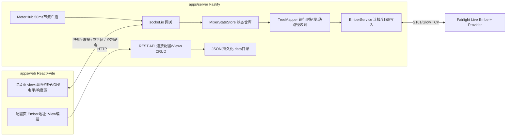

# 架构设计

## 总览



生产部署时 Fastify 同时托管前端构建产物,前后端同源、单端口。

## 后端分层职责

| 模块 | 职责 |
| --- | --- |
| `EmberService` | Ember+ 连接生命周期(连接/断线/自动重连/超时)、树展开、目录变化后重新展开、参数订阅、参数写入、function 调用。只处理原始 Ember 节点,不理解业务含义 |
| `TreeMapper` | 运行时树发现:遍历实际树,按节点 identifier 模式识别通道、各类总线、响度节点,建立"逻辑通道模型 ↔ Ember 路径"映射。树变化时增量更新映射并发出事件;无法识别的节点安全忽略并记日志 |
| `MixerStateStore` | 规范化业务状态:通道清单(id、类型、名称、level、mute)、响度、连接状态。事件驱动,是 WS 网关的唯一数据源 |
| `MeterHub` | 电平/响度更新的聚合与 50ms 节流,批量成帧后交给 WS 网关广播,与状态增量通道分离 |
| WS 网关 | socket.io:下行快照/增量/电平帧,上行控制命令(zod 校验 + ack 回执) |
| REST API | Ember 连接配置、views CRUD、健康检查;JSON 持久化到 `data/` |

**关键原则:除 TreeMapper 外,任何代码不接触原始 Ember 路径。** 上层(Store、API、前端)只使用逻辑通道模型;Ember+ 是自描述协议,路径结构只能在运行时确认(见 `fairlight-ember.md`)。

## 逻辑通道模型

```ts
interface ChannelRef {
  id: string;          // stable id derived from Ember path, e.g. "channel/3", "main/1"
  kind: 'channel' | 'main' | 'sub' | 'aux' | 'mixm' | 'mtx';
  name: string;        // user-facing name from the mixer
}

interface ChannelState extends ChannelRef {
  levelDb: number;     // fader level in dB
  muted: boolean;      // protocol-level mute; UI renders inverted as "ON"
  meterDb: number;     // latest meter value in dB
}
```

ON 开关 = mute 取反,仅在前端展示层反转;协议层与后端状态始终存 `muted`。

## 前后端通信

### socket.io 事件(契约在 `packages/shared`,zod 校验)

下行:

| 事件 | 内容 | 时机 |
| --- | --- | --- |
| `mixer:snapshot` | 全量状态(通道清单+状态+响度+连接状态) | 连接建立、重连、树结构变化后 |
| `mixer:patch` | 增量(level/mute/name 变化、通道增删) | 状态变化时 |
| `meters:frame` | 紧凑数组 `[id, meterDb][]` + 响度读数 | 50ms 节流批量 |
| `system:status` | Ember 连接状态变化 | 变化时 |

上行(均带 ack 回执):

| 事件 | 内容 |
| --- | --- |
| `control:set-level` | `{ id, levelDb }` |
| `control:set-on` | `{ id, on }`(网关内翻转为 mute 写入) |
| `control:reset-loudness` | 无参数 |

电平帧使用 socket.io volatile emit(丢帧可接受,状态增量不可丢)。

### REST(`/api/v1`)

| 方法与路径 | 用途 |
| --- | --- |
| `GET /api/v1/connection` | 读取 Ember host/port 与连接状态 |
| `PUT /api/v1/connection` | 更新 Ember host/port(触发重连) |
| `GET /api/v1/views` / `POST /api/v1/views` | views 列表 / 新建 |
| `PUT /api/v1/views/:id` / `DELETE /api/v1/views/:id` | 更新 / 删除 |
| `GET /api/v1/health` | 健康检查 |

## View 与失配处理

View 存储通道引用:`{ channelId, lastKnownName }`。树变化(通道删除/重排)后:

- 快照中不存在的 `channelId`:混音页渲染占位卡片(显示 `lastKnownName` + 缺失标记),不阻塞其它通道
- 配置页对失效引用给出警告,提供一键清理
- View 本身不自动修改,由用户决定清理或保留(通道可能是临时移除)

## 持久化

`data/config.json`,zod 校验,写入原子化(临时文件 + rename):

```jsonc
{
  "version": 1,
  "ember": { "host": "127.0.0.1", "port": 9000 },
  "views": [
    { "id": "uuid", "name": "FOH", "channels": [ { "channelId": "channel/3", "lastKnownName": "BASS" } ] }
  ]
}
```

文件损坏或缺失时回退默认配置并告警,不崩溃。

## 前端结构

- `store/`:zustand——`mixerStore`(快照+增量合成)、`meterStore`(高频帧,独立于 React 树渲染,电平表组件直接订阅避免整页重渲)、`viewStore`
- 推子拖动:拖动中本地值优先(pending 态),ack 后释放;远端更新在拖动中不覆盖本地值
- 断线:UI 进入降级态(控件禁用+提示),socket.io 自动重连后以新快照恢复
- 视觉基线:所有前端页面固定使用深色主题,不跟随系统浅色偏好,也不提供深浅色切换;后续页面复用全局深色设计 token
- 动效基线:交互和状态组件使用简短、克制的过渡避免状态跳变生硬,拖动等直接操作保持即时跟手;非必要动效响应 `prefers-reduced-motion`
- 文本基线:除设备或应用运行时带入的动态文本(如通道名称)外,前端所有固定 UI 文本使用英文

## 部署

- **Docker**:多阶段构建(install → build → runtime,node:22-alpine);server 托管 web 产物;`data/` 挂卷
- **Windows**:`pnpm build` 后 `node apps/server/dist/main.js`,提供启动脚本;无原生依赖,跨平台无需特殊处理
