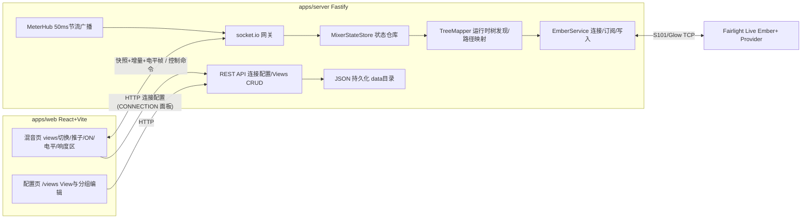

# 架构设计

## 总览



生产部署时 Fastify 同时托管前端构建产物,前后端同源、单端口。

## 后端分层职责

| 模块 | 职责 |
| --- | --- |
| `EmberService` | Ember+ 连接生命周期(连接/断线/自动重连/超时)、树展开、目录变化后重新展开、参数订阅、参数写入、function 调用。只处理原始 Ember 节点,不理解业务含义。S101 keepalive 由 `emberplus-connection` 在 TCP 连上后自动维持(每 10 s 发 KeepAliveRequest,500 ms 内无应答即关闭 socket,同时自动应答 Provider 的请求),库不提供配置项;关闭会以 `disconnected` 进入本服务的退避重连。记录最近一次连接失败的简短原因(`lastError`,如 `Timeout after 5000ms: connect`):重试期间保留,连接成功、重新配置端点或停止服务时清空;状态事件以 `(status, lastError)` 去重,原因变化时即使状态枚举不变也会广播。注意 `emberplus-connection` 会吞掉 ECONNREFUSED 并自行重拨,因此地址错误在本服务表现为 connect 超时 |
| `TreeMapper` | 运行时树发现:遍历实际树,按节点 identifier 模式识别通道、各类总线、响度节点,建立"逻辑通道模型 ↔ Ember 路径"映射。树变化时增量更新映射并发出事件;无法识别的节点安全忽略并记日志 |
| `MixerStateStore` | 规范化业务状态:通道清单(id、类型、名称、level、mute)、响度、连接状态与最近连接失败原因(`connectionError`)。事件驱动,是 WS 网关的唯一数据源 |
| `MeterHub` | 电平/响度更新的聚合与 50ms 节流,批量成帧后交给 WS 网关广播,与状态增量通道分离 |
| WS 网关 | socket.io:下行快照/增量/电平帧,上行控制命令(zod 校验 + ack 回执) |
| REST API | Ember 连接配置、views CRUD、健康检查;JSON 持久化到 `data/` |

**关键原则:除 TreeMapper 外,任何代码不接触原始 Ember 路径。** 上层(Store、API、前端)只使用逻辑通道模型;Ember+ 是自描述协议,路径结构只能在运行时确认(见 `fairlight-ember.md`)。

## 逻辑通道模型

```ts
interface ChannelRef {
  id: string;          // stable id derived from Ember path, e.g. "channel/3", "main/1"
  kind: 'channel' | 'main' | 'sub' | 'aux' | 'mixm' | 'mtx';
  name: string;        // user-facing name from the mixer
}

interface ChannelState extends ChannelRef {
  levelDb: number;     // fader level in dB
  muted: boolean;      // protocol-level mute; UI renders inverted as "ON"
  meterDb: number;     // latest meter value in dB
}
```

ON 开关 = mute 取反,仅在前端展示层反转;协议层与后端状态始终存 `muted`。

## 前后端通信

### socket.io 事件(契约在 `packages/shared`,zod 校验)

下行:

| 事件 | 内容 | 时机 |
| --- | --- | --- |
| `mixer:snapshot` | 全量状态(通道清单+状态+响度+连接状态) | 连接建立、重连、树结构变化后 |
| `mixer:patch` | 增量(level/mute/name 变化、通道增删) | 状态变化时 |
| `meters:frame` | 紧凑数组 `[id, meterDb][]` + 响度读数 | 50ms 节流批量 |
| `system:status` | `{ ember, lastError? }`:Ember 连接状态与可选的最近连接失败原因 | 状态或原因变化时;每个 socket 连接建立后紧随快照再发一次(快照不带原因) |

上行(均带 ack 回执):

| 事件 | 内容 |
| --- | --- |
| `control:set-level` | `{ id, levelDb }` |
| `control:set-on` | `{ id, on }`(网关内翻转为 mute 写入) |
| `control:reset-loudness` | 无参数 |

电平帧使用 socket.io volatile emit(丢帧可接受,状态增量不可丢)。

### REST(`/api/v1`)

| 方法与路径 | 用途 |
| --- | --- |
| `GET /api/v1/connection` | 读取 Ember host/port、连接状态与可选的 `lastError` |
| `PUT /api/v1/connection` | 更新 Ember host/port(触发重连);响应形状同 GET,`lastError` 反映对新地址的首次尝试结果 |
| `GET /api/v1/views` / `POST /api/v1/views` | views 列表 / 新建 |
| `PUT /api/v1/views/:id` / `DELETE /api/v1/views/:id` | 更新 / 删除 |
| `GET /api/v1/health` | 健康检查 |

## View 与失配处理

Fairlight Live 不为通道提供稳定 ID:在通道之间插入或调整次序都会让 Ember identifier(以及由它派生的逻辑 `channelId`)重新编号。因此 View 以**通道类型 + 名称**引用通道:

```ts
interface ViewChannelRef {
  kind: ChannelKind;          // 类型限定,避免输入 "MIC" 与 aux "MIC" 互相误配
  name: string;               // 通道 name 参数(与节点 description 相同),trim 后精确、大小写敏感匹配
  channelId?: string;         // 勾选时的逻辑 id,只用于同名通道之间的优先裁决
  groupId?: string;           // 所属分组,必须存在于 view.groups
  color?: ChannelPaletteKey | 'group';  // 覆盖类型默认色;'group' 表示跟随所属组的颜色
}

interface View {
  id: string;
  name: string;
  channels: ViewChannelRef[]; // 渲染顺序;同组成员在数组中连续
  groups: { id: string; name: string; color?: ChannelPaletteKey }[];
}
```

匹配规则(`apps/web/src/features/mixer/view-resolver.ts`,混音页与配置页共用):第一遍认领 `kind + name + channelId` 全部相同的实时通道;第二遍为剩余引用认领第一个未被认领的同 `kind + name` 通道;每个实时通道最多被一个引用认领;名称不匹配时**不会**回退到 `channelId`(重排后 id 指向的是别的推子,比显示缺失更危险)。配置页对同名重复的实时通道标注 `DUPLICATE NAME`。

旧持久化形状 `{ channelId, lastKnownName }` 由 shared schema 在读取时原地迁移为 `{ kind, name, channelId }`,不提升配置版本;服务端回写时统一为新形状。

树变化(通道删除/改名)后:

- 解析不到实时通道的引用:混音页渲染占位卡片(显示引用的 `name` + 缺失标记),不阻塞其它通道
- 配置页对失效引用给出警告,提供一键清理(改本地草稿、只删失效引用、保留分组,由 SAVE VIEW 提交;不保存即可放弃)
- View 本身不自动修改,由用户决定清理或保留(通道可能是临时移除)

### 通道分组

- 一个 View 可包含多个命名分组,分组与勾选、排序、配色一样只改本地草稿,由 `SAVE VIEW` 统一保存
- 配置页把 `channels` 显示为「块」序列:连续同组的引用是一个组块(可改名、整块上下移动、单击 `UNGROUP` 解散,成员原位保留为无组),无组引用是单行;分组下拉把通道移动到目标组块末尾,`UP`/`DN` 在组内移动或跨过相邻块
- 拖放编排(`@dnd-kit/core` + `@dnd-kit/sortable`,鼠标、触屏、键盘三种传感器,每种输入各一个,互不抢同一次按压:`MouseSensor` 在按下把手后移动超过 `MOUSE_ACTIVATION_DISTANCE_PX` 起拖,`TouchSensor` 需要手指在把手上停留 `TOUCH_ACTIVATION_DELAY_MS`、期间位移超过 `TOUCH_ACTIVATION_TOLERANCE_PX` 即视为滚动而取消,`KeyboardSensor` 由 Space 拾起):每个通道行、组头与 AVAILABLE CHANNELS 条目各有一个专用拖动把手(可访问名 `Drag <name>` / `Drag group <name>`),其它控件不响应拖动。根列表的项是非空块(单行 `channel:<rowKey>`、组 `group:<id>`),每个非空组内嵌一个成员列表并同时是投放容器(`groupzone:<id>`),空分组只作投放容器并留在底部。语义:通道行拖到根列表任意位置即重排(源在组内则脱组);拖到某组成员之间或组头/空组上即编组;组头只能在根列表移动,不能进入别的组;未勾选的可用通道可拖入任意位置或任意分组,勾选框行为不变。落点规则同列表与跨列表一致:指针在某一行(或组块)中线之上即落到它之前、之下即落到之后,命中组容器时组头(组块上半)即组首、组底(下半)即组尾;键盘无指针,同列表内下移落到目标行之后、上移落到之前,跨列表落到目标行之前(`drag-preview.ts` 的 `dropHintFor`)。把 dnd-kit 的 `over` 连同该提示解析为 `DropTarget`(`features/settings/drop-resolver.ts`),再调用 `view-order.ts` 的纯函数:`moveChannelTo(view, index, target)`(先移除源再定位,`root` 位置按非空块计数、`group` 位置按组成员计数,进组写 `groupId`、出组删除该键)、`insertChannelAt(view, reference, target)`(`kind + name + channelId` 三者全等视为已存在,返回 null)、`moveGroupTo(view, groupId, position)`(空组、未知组、越界与原位返回 null);原位放下或 `over` 为空不改草稿。鼠标与触屏拖动用 `pointerWithin`(行优先于所在组容器),键盘拖动用 `closestCenter` 并以自定义坐标函数把被拖项中心对齐下一个可落目标;传感器初值集中在 `dnd-config.ts`
- 拖动呈现:跟随指针的是 `DragOverlay` 里的克隆(`DragOverlayContent`,内容全部来自 props,不受列表容器裁切与滚动影响;通道行/组头落下或取消时克隆飞向目标行,AVAILABLE 落下与移除无动画),被拖项原位留作占位。拖动期间页面维护一份**预览视图**(`drag-preview.ts`:用同一套纯函数把被拖项放到落点,草稿不变),同列表重排与跨列表(单行进组、成员出组、AVAILABLE 拖入)都按预览视图渲染,被拖项(或 AVAILABLE 的 `PlaceholderRow`)以占位行出现在将要落下的位置,目标组块保持琥珀高亮;DOM 顺序本身就是预览,两个 `SortableContext` 使用不位移任何行的 `previewSortingStrategy`,行的补间由 FLIP 列表负责。预览在 `onDragMove` 与 `onDragOver` 上都同步(指针在同一行内跨过中线也会改变落点),每次按预览视图重渲染后 `DroppableRemeasure` 全量重测 droppable 矩形(根列表重排会推移下方各组成员,dnd-kit 只重测变动列表自身的项)。松手时在预览视图内结算(`settlePreview`:落在占位所在的组容器上或自身上即提交预览视图,落在某一行上按同一中线规则结算,通常与占位一致)后一次性写入草稿,Esc 或 `over` 为空则预览消失。分组边界(首个分组之前、相邻两组之间、末个分组之后)没有根级单行可借用,拖动通道时在这些边界渲染零高度的根级落槽(`RootSlot`,`slot:<position>`,命中带覆盖下方块顶部 `ROOT_SLOT_HEIGHT_PX`),位置按去掉被拖通道后的块序列计算并画在占位行之下,命中即预览到该根级位置且悬停不动;键盘移动跳过被拖行已占的落槽,组拖动不渲染落槽。草稿里一个有序块都没有(没有通道,或只有空分组)时,列表末尾改为渲染一个**占位式**的根级落槽(`root-slot--fill`,`flex: 1` 吃掉列表剩余高度而不是覆盖下方块),新建的 view 因此也能用鼠标或键盘拖入首个通道,空分组仍各自可落;这个落槽按**草稿**而不是预览视图判定是否渲染,否则占位行一出现它就会卸载、指针随即落空、预览被清掉,逐帧反复
- 拖出移除:鼠标或触屏来源的通道行或组头离开 CHANNEL ORDER 列表可见区域超过 `REMOVE_DRAG_THRESHOLD_PX` 时,克隆变红并显示 `DROP TO REMOVE`,松手即把该引用(组头则连同全部成员)从草稿移除,与取消勾选等价;键盘拖动不触发
- 行级删除:每个通道行与每个组头的最右侧有一个删除按钮(自绘 ×,可访问名 `Remove <name>` / `Delete group <name>`),点击即把该引用(组头则连同全部成员)从草稿移除,语义与拖出移除完全一致,调用的也是同两个纯函数(`removeChannel` / `removeGroupWithMembers`)。**不做二次确认**:删除只改草稿,`SAVE VIEW` 之前都能用 `DISCARD CHANGES` 整体撤销。它补上了另外两条路径的缺口——失配引用在 AVAILABLE CHANNELS 里没有条目,取消勾选无从谈起;拖出移除只对鼠标与触屏生效,键盘此前没有任何删除手段。组头上它与 `UNGROUP` 并列而语义相反:`UNGROUP` 只解散组、成员原位留为无组行,删除按钮连成员一起带走。两者在拖动期间都禁用,因为列表这时渲染的是预览视图、行拿到的是预览索引,按它删会删错行。删组不清理折叠集合(组 id 来自 `createLocalId` 不会复用,孤儿 id 撞不上新组),与 `UNGROUP` 的既有行为一致
- 拖动中的滚动:关闭 dnd-kit 自带的自动滚动(它只滚动被拖节点的祖先,从 AVAILABLE 拖出时会滚错容器),由 `ListAutoScroller` 按拖动期间自行跟踪的指针位置(dnd-kit 的位移量含滚动补偿,不能直接用)在 CHANNEL ORDER 列表**可见部分**的上下边缘区(`AUTO_SCROLL_EDGE_PX`)内按距离比例逐帧滚动该列表(上限 `AUTO_SCROLL_MAX_STEP_PX`),每次滚动后节流调用 `measureDroppableContainers` 重测各行矩形;拖动期间 AVAILABLE 列表加 `is-drag-locked` 禁止竖向滚动,两个列表容器 `overflow-x: hidden`
- 混音页按同样的连续段渲染:每个组段复用 `All Channels` 的类型分区样式(竖排标题 = 组名,计数 = 在场通道数),无组引用平铺;含分组的 View 也支持 `TYPE ROWS` 横排布局
- 分组折叠:组头把手之后有一个折叠按钮(自绘 chevron,`aria-expanded`、`aria-controls` 指向成员列表,可访问名 `Collapse group <name>` / `Expand group <name>`),空分组不显示。折叠是**编辑器的 UI 状态**,不进 View 模型、不持久化,切换 view、`UNGROUP` 与 `DISCARD` 都会清掉;折叠时成员整体不渲染(而不是隐藏,隐藏的行仍会注册零矩形的 droppable),组头保留全部控件,`<nn> CH` 就是成员数提示,组块加 `is-collapsed`。折叠的组仍是投放容器:`groupzone` 的 `data` 带 `collapsed`,`keyboardStops` 把「空的或折叠的」组当作停靠点(展开的组与成员共用矩形,只有成员算停靠点);占位行一旦预览进某个折叠组,该组立即展开并退出折叠集合,拖动结束后保持展开。展开与预览在同一批提交,占位行不会被渲染进还关着的组;`GROUP` 下拉把通道放进某个组时同样先展开——两条通往组内的路径都保证「放进去的东西看得见」,也顺带避免了「折叠时被清空的组,再放回第一个通道又被藏起来」(空组不显示折叠按钮,没有控件能把它重新打开)
- 键盘拖放的收敛:一次方向键只产生一次移动。每次预览后行会重排,dnd-kit 会带着上一次方向键定下的落点重新做碰撞检测,那些额外的碰撞只是几何在安顿,不是新的意图,所以 `syncPreview` 按「键盘步数」忽略它们;松手时同理,只有当最后报告的 droppable 与预览所在的列表相同(只能微调位置)才用它结算,否则直接提交预览——否则折叠组一展开,盖在组头上的根级落槽就会立刻把行拽回根列表
- 分组与通道条的颜色(解析集中在 `features/mixer/channel-colors.ts`,配置页与混音页共用):
  - `groupAccent(group, leadKind)`:组有 `color` 就取该色,否则取**首个在场成员的类型色**(刻意忽略成员自己的覆盖,否则跟随组色的成员会与组互相引用),没有在场成员时按输入通道色
  - `channelAccent(kind, color, group, leadKind)`:`color` 为 `'group'` 时跟随 `groupAccent`,自定义色直接取,没有颜色则取类型色;`'group'` 却没有组(草稿编辑中的一瞬)按类型色兜底
  - 通道行的调色板为 `AUTO` /(仅在组内)`GRP` / 6 个色块,组头另有 `GROUP COLOR`(`AUTO` + 6 色)。「跟随组色」画的是缩写字样而不是色块——它显示的颜色往往与右边某个色块完全一样,两个同色方块分不出哪个是「跟随」哪个是「选定」;颜色本身由行左侧的 accent 条呈现。两处调色板共用 `PaletteControl.tsx`,由调用方传入 `choices`(各自的可访问名、色块或字样)。进出组时颜色自动转换(`view-order.ts` 的 `colorForMembership`,由 `assignGroup`、`moveChannelTo`、`insertChannelAt`、`removeGroup` 共同调用):进入某个组时 `AUTO` → `'group'`,离开组时 `'group'` → `AUTO`,自定义色两个方向都保持,组内重排不变。因此已保存的旧 view 里组内没有颜色的引用会在**跨组或出组移动一次后**升级为 `'group'`,不做批量迁移
- 服务端只校验组 id 唯一、`groupId` 必须指向已存在的组、`color` 为 `'group'` 的引用必须有 `groupId`,不强制连续

## 持久化

`data/config.json`,zod 校验,写入原子化(临时文件 + rename):

```jsonc
{
  "version": 1,
  "ember": { "host": "127.0.0.1", "port": 9000 },
  "views": [
    {
      "id": "uuid",
      "name": "FOH",
      "channels": [
        { "kind": "channel", "name": "BASS", "channelId": "channel/3", "groupId": "g1", "color": "group" },
        { "kind": "channel", "name": "GTR", "channelId": "channel/4", "groupId": "g1", "color": "purple" },
        { "kind": "main", "name": "Main", "channelId": "main/1" }
      ],
      "groups": [{ "id": "g1", "name": "Rhythm", "color": "teal" }]
    }
  ]
}
```

文件损坏或缺失时回退默认配置并告警,不崩溃。

## 前端结构

- 路由:`/` 混音页(CONTROL DESK)、`/views` 配置页(VIEW CONFIGURATION),基于 history API 的自绘路由(`lib/router.ts`,不引入路由库),浏览器前进/后退可用;两页互斥挂载,切换时滚动回顶部。生产环境 Fastify 对非 `/api` 的 GET 未命中返回 `index.html`,刷新与深链接可用。路由模块缓存「当前已放行的路由」并从该缓存出快照(无订阅者时重读 URL),`setNavigationGuard(guard | null)` 挂一个守卫:`navigate()` 改写 history 前先询问,被拒绝则不改 history、不通知;`popstate` 目标与缓存不同时也询问,被拒绝则沿来路撤销该次跳转(每个 history 条目的 `state.routeIndex` 记录序号,`history.go(当前序号 - 目标序号)` 对后退、前进与多步跳转同样成立;没有序号的条目只能来自后退,用 `history.forward()`),缓存不变,因此 `useRoute()` 不会闪到被拒绝的页面。只有配置页注册守卫(挂载时注册、卸载时置 null),混音页不注册
- 配置页是 CONTROL DESK 的次级页面:页头为带箭头图标的返回按钮 + 面包屑 eyebrow;页面固定为视口高度,视图列表与编辑器两列各自滚动,不产生整页滚动条。`features/settings/` 拆为 `SettingsPage`(状态、草稿与保存)、`ViewDndContext`(dnd-kit 上下文与落下解析)、`ChannelOrderList` / `SortableChannelRow` / `SortableGroupBlock`(右侧列表,`ChannelOrderList` 同时持有 FLIP 列表并经 `flipRef` 把 `capture()` / `skipNext()` 交回页面)、`PaletteControl`(两处共用的调色控件)、`DeleteButton` 与 `RowMenu`(行与组头共用的删除键和窄屏菜单)、`AvailableChannelList`(左侧清单)与 `DiscardChangesDialog`
- 列表位移动效:`features/settings/use-flip-list.ts` 挂在 `ChannelOrderList` 内部(它才是渲染拖动预览的组件),在**每次提交**后的 `useLayoutEffect` 里读取列表内所有 `[data-flip-key]` 元素的 rect 并刷新基线,只有当依赖(渲染所用的视图)变化时才补间:位移超过 `FLIP_MIN_SHIFT_PX` 的元素先设反向 `transform`,下一帧清除并以 `transform <FLIP_DURATION_MS>ms ease-out` 过渡,结束后移除内联样式(`FLIP_CLEANUP_FALLBACK_MS` 为该时长的三倍作兜底)。每次提交都测量、只按依赖补间,是因为行也会因与重排无关的原因移动(重名标记出现、清单解析完成),那些不该被当成重排。组成员只补间相对所属组块的位移,新出现的元素与标了 `data-flip-skip` 的元素(被拖行与 AVAILABLE 占位行,它们要跟着指针而不是拖在后面)不处理。行的 key 为 `kind:name:channelId#<出现序号>`(`row-keys.ts`),组块为 `group:<id>`,React key 与 dnd-kit id 同用该值。箭头移动、编组/脱组、`UNGROUP`、整组移动、勾选加入/移除、`CLEAR INVALID`、**拖动期间占位行每一次移动**、Esc 取消回位与拖放落下都走同一套补间;拖放落下前先把拖动态的 rect 记为基线(`capture()`),并关闭 dnd-kit 自身的布局动画,避免两套补间叠加;切换 view 时先 `skipNext()`,两个 view 里 key 相同的行才不会「飞」过去。`DragOverlay` 落下动画的时长是 `DROP_ANIMATION_MS`(`dnd-config.ts`)。dnd-kit 默认用 `getTransformAgnosticClientRect` 测量 droppable,因此补间中的反向 transform 不会污染命中矩形。`prefers-reduced-motion: reduce` 时不做补间
- 配置页的响应式:VIEWS 一列宽 `clamp(12rem, 20vw, 21rem)`,随视口连续收窄(笔记本上仍是 21rem,1366px 约 273px,1024px 约 205px),不用断点;视口 ≤1200px 时它已到最窄一带,再压缩内边距与条目行高。CHANNEL ORDER 一列是 `container-type: inline-size` 的查询容器,**每一行都必须保持单行**——换行的行不再读作「一个通道和它的控件」。三档按代价从小到大让出宽度:容器 ≤45rem 去掉通道名列的 7rem 下限(名字本来就带省略号)并收紧行内间距;≤36rem 隐藏 6 个色块、改用 `PaletteControl` 一直并排渲染着的 `<select>` 菜单,并隐藏 `GROUP` 下拉前面的字样(`<select>` 自带可访问名);≤26rem(手机竖屏)把**上下按钮、`GROUP` 下拉、颜色菜单、`UNGROUP`、删除按钮**一起藏掉,改用行尾一直渲染着的汉堡菜单(`RowMenu`),行只剩把手、序号、accent 与名字。控件始终都在 DOM 里,由容器查询 `display: none` 只显示一套,被隐藏的那套不进无障碍树,也不参与栅格——因此切换不需要测量、不引入状态,拖动中也不会重排。`RowMenu` 是一个盖在汉堡方块上的透明原生 `<select>`:弹出层由浏览器绘制,不需要定位、不会被列表裁切、不改行高,手机上直接用系统选择器;它的项是 `<option>`(`role="option"`),因此不与宽档已经占用的可访问名(`Move <name> up`、`<name> group`、`Ungroup <name>`)重名——jsdom 不求值容器查询、两套控件在测试里同时在场,这一点是必须的。它没有「当前值」,选中即执行并复位;当前所在组与当前颜色在选项文本前加 `•` 标出。汉堡档下这个菜单是行上唯一的控件,又只出现在没有指针的设备上,所以放大到 2.75rem 的方块,行高随之从 54px 长到 62–63px。前两个阈值是实测的(以**组内成员**为准,它额外带着组缩进,是最窄的一种行):带名字下限的形态撑到 43.5rem、带截断名字的撑到 34.6rem,阈值取在其上,保证换挡时上一形态仍然放得下;第三个阈值不是为了放得下(菜单形态一路撑到 21.3rem),而是为了覆盖手机竖屏——26rem 对应约 440px 以内的视口
- 未保存改动保护:`features/settings/view-dirty.ts` 的 `isViewDirty(saved, draft)` 结构比较名称、通道引用(顺序与全部字段,缺键与 `undefined` 相等)与分组;脏态三处提示为 `SAVE VIEW` 的 `is-dirty` 高亮、旁边的 `UNSAVED` 徽标、左侧列表当前项的圆点(`data-dirty="true"` + 视觉隐藏文本 `Unsaved changes`)。返回混音页(页头按钮与浏览器后退)、切换到另一个 view、删除当前 view(两段式的第二次点击)、`ADD` 新建 view 四条路径在脏态时统一进入一个 `pendingAction`,弹出自绘 `UNSAVED CHANGES` 对话框(`role="dialog"`、`aria-modal`、正文按路径区分),`DISCARD` 先清空草稿再执行待定操作,`KEEP EDITING`(以及 Esc、背景点击)关闭对话框并保留草稿;点击已选中的 view 不再重置草稿。脏态时在 `window` 上注册 `beforeunload`(`preventDefault` + `returnValue`)拦截刷新与关闭标签页;保存成功或 `DISCARD` 后提示立即消失,保存失败保持脏态。CONNECTION 面板不做脏检测
- `store/`:zustand——`mixerStore`(快照+增量合成、socket/Ember 连接态与 `emberLastError`)、`meterStore`(高频帧,独立于 React 树渲染,电平表组件直接订阅避免整页重渲)、`viewStore`
- `lib/`:`socket.ts`(Socket.IO 绑定与控制 ack)、`views-api.ts` 与 `connection-api.ts`(REST client,共用 `api-request.ts` 的 fetch 注入、zod 响应解析与 `{ error: { code, message } }` 读取)、`router.ts`
- 连接配置:两个页面头部的连接状态灯是按钮(可访问名 `Connection settings`),点击打开 `features/connection/` 的 CONNECTION 面板——自绘模态对话框(`role="dialog"`、`aria-modal`、焦点进入面板并在其中循环、Esc/背景/CANCEL 关闭、关闭后焦点回到状态灯;模态行为由 `components/use-modal-dialog.ts` 提供,配置页的确认对话框复用同一 hook 与样式 token),在 `App` 层渲染一次并跨路由存活。面板打开时从 `GET /api/v1/connection` 回填 host/port,提交前用 shared 的 `emberEndpointSchema` 校验并就地显示英文错误,服务端 400 的 message 同样就地显示;Ember 已连接时 APPLY 先变为 `CONFIRM RECONNECT` 并说明将断开当前设备,再次点击才发 PUT;提交成功后面板保持打开,实时显示 `mixerStore` 中的 Ember 状态与 `lastError`。面板只写应用配置,不接触任何通道参数
- 混音页空态按原因分流(`features/mixer/empty-state.ts`,配置页 AVAILABLE CHANNELS 列表复用):socket 离线 → `BACKEND OFFLINE`(无 CTA);socket 已连但 Ember 未连接 → `MIXER NOT CONNECTED` + 当前状态 + `lastError` + `CONFIGURE CONNECTION` 按钮直达面板;已连接且快照通道数为 0 → `NO CHANNELS ON THE MIXER`(无 CTA);已加载过清单后短暂 `reconnecting` 继续显示既有条带并禁用控件,不回退到空态;空 View 仍显示 `THIS VIEW HAS NO CHANNELS`(配置页的同一文案改为列表内的一行,列表容器始终渲染)
- 推子拖动:拖动中本地值优先(pending 态),ack 后释放;远端更新在拖动中不覆盖本地值
- 断线:UI 进入降级态(控件禁用+提示),socket.io 自动重连后以新快照恢复
- 视觉基线:所有前端页面固定使用深色主题,不跟随系统浅色偏好,也不提供深浅色切换;后续页面复用全局深色设计 token
- 动效基线:交互和状态组件使用简短、克制的过渡避免状态跳变生硬,拖动等直接操作保持即时跟手;非必要动效响应 `prefers-reduced-motion`
- 文本基线:除设备或应用运行时带入的动态文本(如通道名称)外,前端所有固定 UI 文本使用英文

## 部署

- **Docker**:多阶段构建(install → build → runtime,node:22-alpine);server 托管 web 产物;`data/` 挂卷
- **Windows**:`pnpm build` 后 `node apps/server/dist/main.js`,提供启动脚本;无原生依赖,跨平台无需特殊处理
